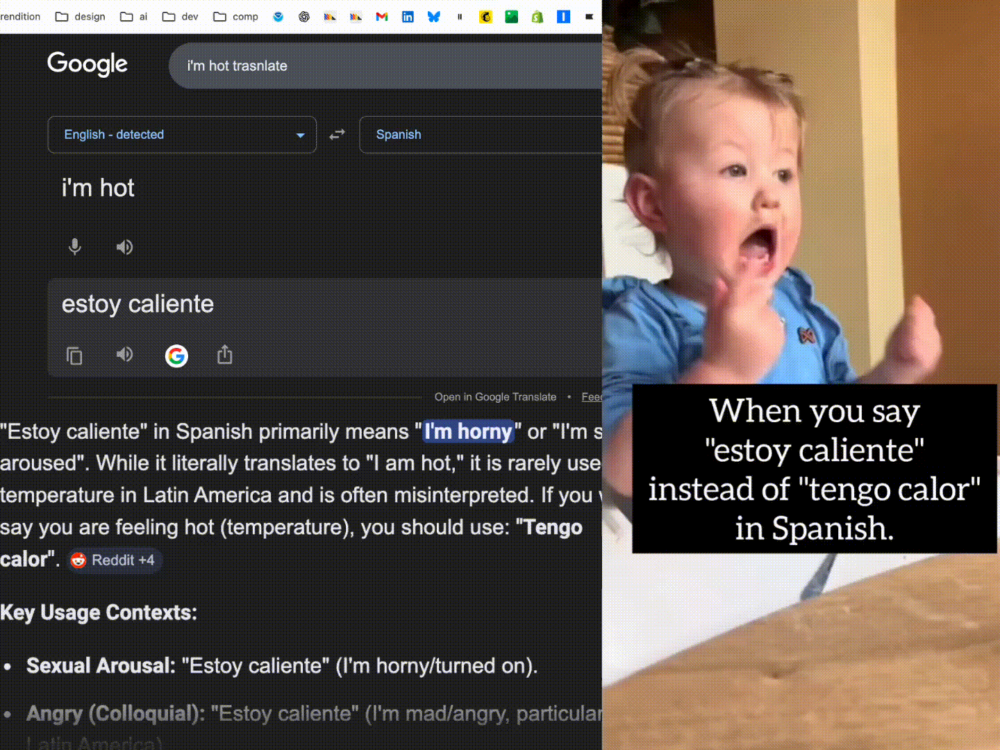
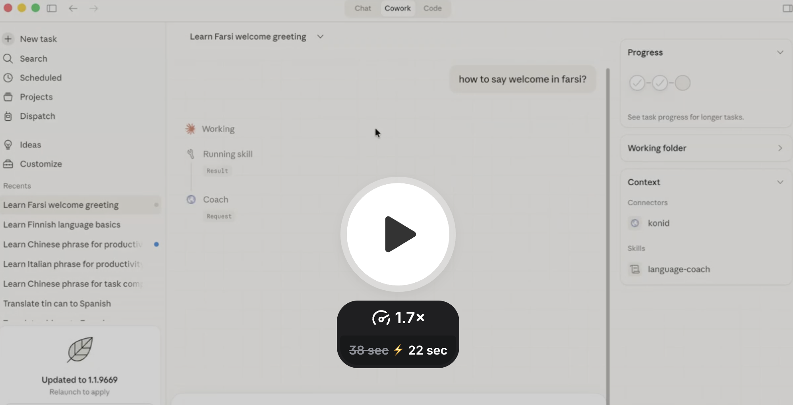
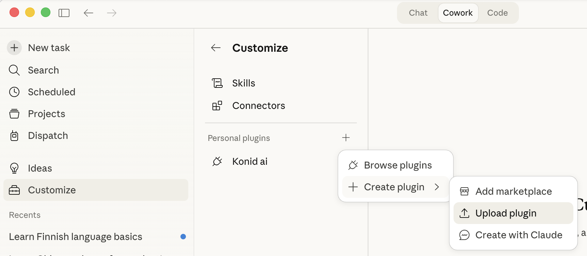

# konid

*konid* (کنید) — Farsi for "do." Take action.

A language expression coach. Tell it what you want to say, and it shows you how a native speaker would actually say it — with cultural context, tone notes, and audio pronunciation.

<p align="center">
  
</p>

## Install

### Claude Cowork

> Requires a Pro or Max subscription.

<a href="https://www.loom.com/share/9ae0d46f7c6d4a6caa2847351aa18ae8">
  
</a>

1. Download [`konid-ai-plugin.zip`](docs/konid-ai-plugin.zip)
2. In Cowork, click **Customize** in the left sidebar
3. Click **+** next to "Personal plugins" > **Upload plugin**
4. Choose the `konid-ai-plugin.zip` file

<p align="center">
   + > Upload plugin" width="500">
</p>

That's it. Start a new task and ask *"how do I say 'nice to meet you' in Japanese?"*

### Claude Code

Requires Node.js 18+ and an [Anthropic API key](https://console.anthropic.com/settings/keys).

```bash
claude mcp add konid-ai -- npx -y konid-ai
```

Audio plays directly through your speakers.

### Other MCP clients

konid works with any MCP-compatible client. Add this to your client's MCP config:

```json
{
  "mcpServers": {
    "konid": {
      "command": "npx",
      "args": ["-y", "konid-ai"]
    }
  }
}
```

Tested with Cursor, VS Code Copilot, Windsurf, Zed, and JetBrains.

### ChatGPT

Settings > Apps > Advanced settings > Developer mode > add `https://konid.fly.dev/mcp`

## How it works

**You:** "how do I say 'we'll see' in Chinese?"

**konid returns 3 options, casual to formal:**

1. **再说吧** (zài shuō ba) — casual, slightly evasive, can function as a soft "no"
2. **看情况吧** (kàn qíngkuàng ba) — "depends on the situation," genuinely open-minded
3. **到时候再看吧** (dào shíhou zài kàn ba) — "let's wait and see," most neutral

Plus cultural context, nuance comparison, and audio pronunciation.

Supports 13+ languages including Mandarin, Japanese, Korean, Spanish, French, German, Portuguese, Italian, Russian, Arabic, and Hindi. Any language Claude knows can be coached.

## License

MIT
